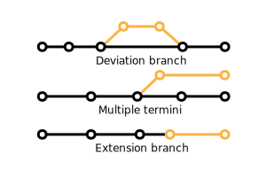

### Branches

Some routes may include branches. Alignment and stops are shared amongst these branches, but each also serves distinct stops and alignment sections. The relationship among branches may be indicated by route name(s), headsigns, and trip short name using the further guidelines below.

<figure id="branching-fig">
<figcaption>Below: Three potential configurations of route branches. Primary alignment is in black. Branch is colored gold.</figcaption>

</figure>

| Field Name | Recommendation |
| --- | --- |
| All Fields | In naming branch routes, it is recommended to follow other passenger information materials. Below are descriptions and examples of two cases: |
| If timetables and on-street signage represent two distinctly named routes (e.g. 1A and 1B), then present this as such in the GTFS, using the `route_short_name` and/or `route_long_name` fields. Example: GoDurham Transit [routes 2, 2A, and 2B](https://gotriangle.org/sites/default/files/brochure/godurham-route2-2a-2b_1.pdf) share a common alignment throughout the majority of the route, but they vary in several different aspects. <ul><li>Route 2 is core service, running most hours.</li><li>Route 2 includes a deviation on Main Street nights, Sundays, and holidays.</li><li>Routes 2A and 2B operate daytime hours Monday through Saturday.</li><li>Route 2B serves additional stops in a deviation of the shared alignment path.</li></ul> |
| If agency-provided information describes branches as the same named route, then utilize the `trips.trip_headsign`, `stop_times.stop_headsign`, and/or `trips.trip_short_name` fields. Example: GoTriangle [route 300](https://gotriangle.org/sites/default/files/route_300_v.1.19.pdf) travels to different locations depending on the time of day. During peak commuter hours extra legs are added onto the standard route to accommodate workers entering and leaving the city. |
